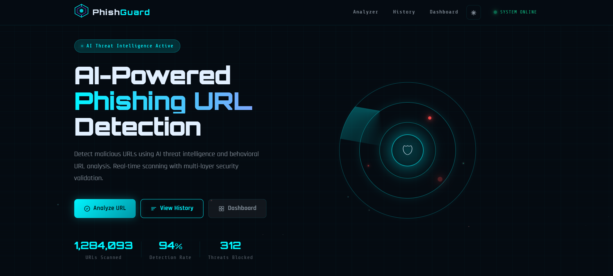
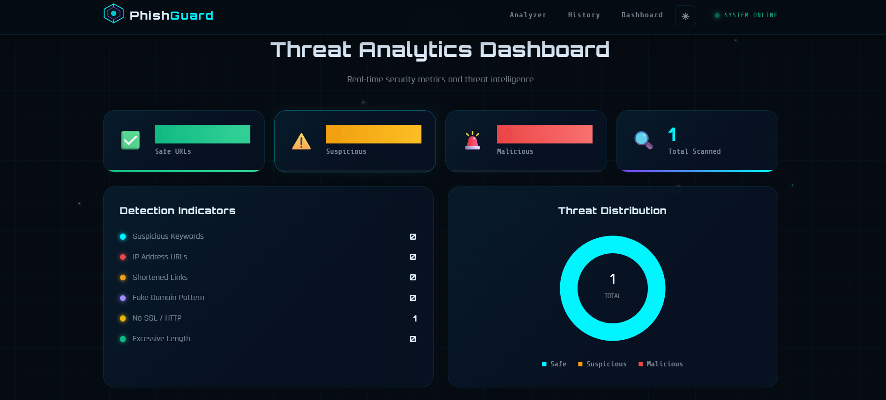
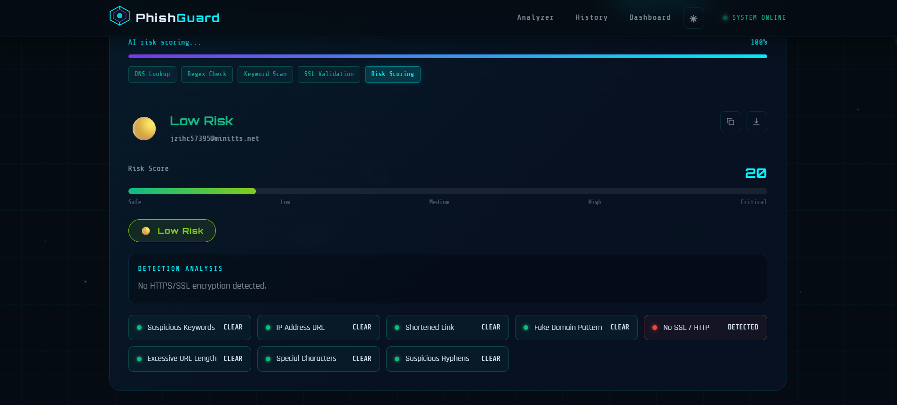
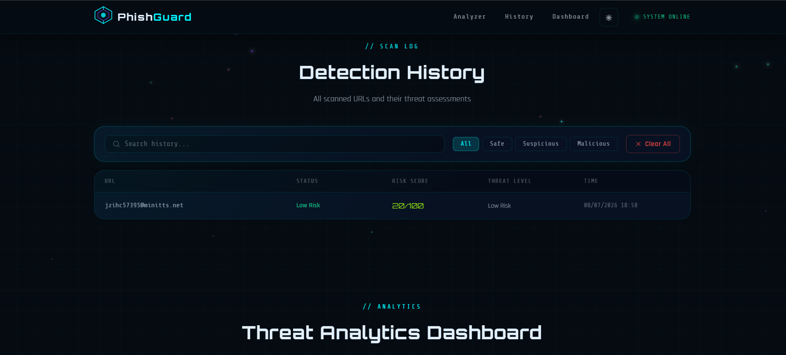

# 🛡️ PhishGuard
### AI-Powered Phishing URL Detection System

<p align="center">
  
</p>


---

## 🚀 Overview

**PhishGuard** is a modern AI-powered phishing URL detection web application designed to identify malicious URLs before users visit them.

The system analyzes URLs using multiple phishing detection techniques, calculates a risk score, classifies the threat level, and provides detailed security insights through a clean cybersecurity dashboard.

Ideal for cybersecurity portfolios, academic projects, and beginner penetration testing demonstrations.

---

# 📸 Project Preview

## 🖥️ Dashboard


## 🔍 URL Threat Analyzer

<p align="center">

</p>

---

## 📊 Threat Detection Result

<p align="center">

</p>

---

## 📜 Scan History

<p align="center">

</p>

---

# ✨ Features

✅ AI-Powered URL Analysis

✅ Real-Time Threat Detection

✅ Risk Score (0-100)

✅ Threat Level Classification

✅ Suspicious Keyword Detection

✅ Fake Domain Detection

✅ IP Address Detection

✅ URL Shortener Detection

✅ URL Encoding Detection

✅ HTTPS Validation

✅ Domain Reputation Checks

✅ Scan History

✅ Beautiful Dashboard

✅ REST API

✅ Responsive Design

---

# 🛠 Tech Stack

## Frontend

- HTML5
- CSS3
- JavaScript

## Backend

- Node.js
- Express.js

## Security

- Helmet
- CORS
- Express Rate Limit

---

# 📂 Project Structure

```
PhishGuard
│
├── public
│   ├── index.html
│   ├── style.css
│   ├── script.js
│
├── routes
│   └── analyzer.js
│
├── controllers
│   └── analyzerController.js
│
├── services
│   └── phishingEngine.js
│
├── screenshots
│   ├── dashboard.png
│   ├── threat-analyzer.png
│   ├── result.png
│   └── history.png
│
├── server.js
├── package.json
├── package-lock.json
└── README.md
```

---

# ⚙️ Installation

Clone Repository

```bash
git clone https://github.com/yourusername/PhishGuard.git
```

Go to Project

```bash
cd PhishGuard
```

Install Packages

```bash
npm install
```

Run Server

```bash
npm start
```

Development Mode

```bash
npm run dev
```

Visit

```
http://localhost:3000
```

---

# 📡 API Endpoints

## Analyze URL

POST

```
/api/analyze
```

Example Request

```json
{
"url":"https://example.com"
}
```

Example Response

```json
{
"status":"Suspicious",
"riskScore":62,
"threatLevel":"High Risk",
"recommendation":"Avoid visiting this website."
}
```

---

## Scan History

GET

```
/api/history
```

---

## Delete History

DELETE

```
/api/history
```

---

# 🧠 Detection Parameters

The phishing engine checks URLs against various security indicators.

| Check | Description |
|---------|------------|
| HTTPS | SSL Certificate Validation |
| Domain Length | Long URLs |
| IP Address | Detects IP URLs |
| Fake Domain | Brand Impersonation |
| URL Shortener | bit.ly etc |
| Suspicious Keywords | login, verify, secure |
| Special Characters | @ % // |
| URL Encoding | Hidden Characters |
| Multiple Hyphens | Fake Domains |
| Numbers in Domain | Numeric URLs |
| Redirect Detection | Hidden Redirects |
| Typosquatting | Fake Brand Domains |

---

# 📊 Risk Score

| Score | Status |
|-------|---------|
| 0-15 | ✅ Safe |
| 16-35 | 🟢 Low Risk |
| 36-55 | 🟡 Medium Risk |
| 56-75 | 🟠 High Risk |
| 76-100 | 🔴 Critical |

---

# 🔒 Security Features

- Helmet Security Headers
- Express Rate Limiting
- CORS Protection
- URL Validation
- Input Sanitization
- Error Handling
- Secure API Design

---

# 📈 Dashboard Features

✔ Total URLs Scanned

✔ Threat Statistics

✔ Safe URLs

✔ Dangerous URLs

✔ Scan History

✔ Risk Distribution

✔ Recent Activity

✔ Responsive Dashboard

---

# 💻 Example Workflow

```
User enters URL

↓

AI Threat Analyzer

↓

Risk Calculation

↓

Threat Classification

↓

Recommendation

↓

Save History

↓

Dashboard Updated
```

---

# 🎯 Future Improvements

- Machine Learning Detection
- VirusTotal Integration
- Google Safe Browsing API
- WHOIS Lookup
- DNS Intelligence
- Domain Reputation API
- Browser Extension
- Email Phishing Scanner
- Login Authentication
- MongoDB Database
- User Accounts
- Admin Dashboard
- Threat Intelligence Feed
- Dark Mode
- Export Reports PDF

---

# 📸 Screenshots

```
screenshots/
│
├── dashboard.png
├── threat-analyzer.png
├── result.png
├── history.png
└── demo.gif
```

---

# 🎥 Demo

<p align="center">

</p>

---

# ⭐ Why This Project?

- Beginner Friendly
- Portfolio Ready
- Recruiter Friendly
- Cybersecurity Project
- Modern UI
- REST API
- Practical Security Concepts
- Real-World Use Case

---

# 🤝 Contributing

Contributions are welcome!

1. Fork the repository

2. Create your feature branch

```bash
git checkout -b feature-name
```

3. Commit your changes

```bash
git commit -m "Added Feature"
```

4. Push

```bash
git push origin feature-name
```

5. Open a Pull Request

---

# 📄 License

This project is licensed under the MIT License.

---

# 👨‍💻 Author

## **Boss Kore**

**Penetration Tester | Ethical Hacker | Bug Bounty Hunter**

### Connect with Me

- 💼 LinkedIn: https://linkedin.com/in/yourprofile
- 💻 GitHub: https://github.com/yourusername
- 📧 Email: your@email.com

---

# 🌟 Support

If you like this project,

⭐ Star this repository

🍴 Fork it

🛡️ Share with the cybersecurity community

---

<p align="center">

## 🔥 Stay Safe. Stay Secure. Stop Phishing with PhishGuard.

</p>

